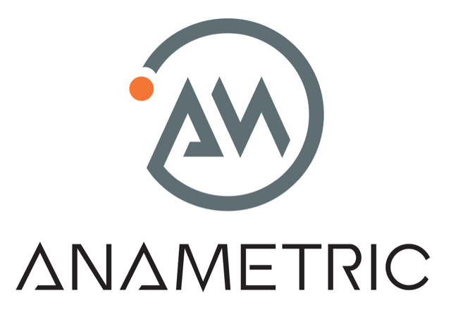

## README - 08-09-2024

##### Alexander Magyari, [alexander@anametric.com](mailto:alexander@anametric.com)

## Table of Contents
+ [About](#about)
+ [Getting Started](#getting_started)
+ [Usage](#usage)
+ [User Guide](./docs/STEER_User_Guide.md#top)
+ [Developer Guide](./docs/STEER_Developer_Guide.md#top)

## About 
The main goal of the STEER Framework is to improve the accessibility, usability and scalability of the NIST STS while maintaining and extending its vital importance in evaluating entropy sources.

## Getting Started 
These instructions will help you get a copy of the STEER Framework up and running on your local machine for development and testing purposes. For more information, read the full userguide in docs/STEER_User_Guide. 

### Prerequisites

Project binaries can be built and executed on Debian-based Linux (e.g., Ubuntu) or macOS - Windows is not currently supported, except under Windows Subsystem for Linux. The source code has been successfully compiled and executed on 64-bit Intel (x64) and ARM (arm64) architectures.

The required installs are listed below:

* `apt` (for Debian-based systems)
* `bash` or compatible shell (5.x or later recommended)
* `brew` (for macOS-based systems using Homebrew)
* `clang` or `gcc`
* `cppcheck`
* `CUnit`
* `doxygen`
* `git`
* `gprof` (used with --with-profiling option)
* `make`
* `port` (for macOS-based systems using MacPorts)
* `scan-build`
* `valgrind`

#### Installing Prerequisites for Linux (Ubuntu)

[Ubuntu Linux 20.04.3 LTS](https://ubuntu.com/download/desktop) or later is recommended as the preferred Debian Linux distribution. Open a terminal window and execute the following commands:

Open a terminal window and execute these commands:

    sudo apt update
    sudo apt -y upgrade
    sudo apt -y install clang clang-tools cppcheck doxygen g++ gcc libcunit1-dev libxml2-utils make valgrind

If you'd like to use Visual Studio Code as your IDE (recommended), execute this command:

    sudo snap install --classic code

#### Installing Prerequisites for macOS

First, make sure you have the Xcode command line developer tools installed on your system. You can verify this by opening a terminal window and entering `xcodebuild -version` – this should return the version of the Xcode command line developer tools installed on your system if it's present.

Next, you will need either MacPorts (recommended) or Homebrew installed on your system. Do __not__ install both MacPorts and Homebrew on the same system – this has been known to create library dependency issues. 

If using MacPorts, open a terminal window and execute these commands:

    sudo port selfupdate
    sudo port upgrade outdated
    sudo port -N install cppcheck doxygen git make

If using Homebrew, execute these commands:

    brew update
    brew upgrade
    brew install cppcheck doxygen git

If you want to use Visual Studio Code on your macOS system, it's recommended that you download the Universal installer from [here](https://code.visualstudio.com/download).

#### Visual Studio Code Setup

If you choose to install and use Visual Studio Code, the following extensions are recommended. Open Visual Studio Code, select the Extensions icon on the sidebar, and search for and install the following:

##### Required Extensions
* C/C++ (Microsoft)

##### Recommended Extensions
* CodeLLDB (Vadim Chugunov)
* Hex Editor (Microsoft)
* Indented Block Highlighting (byi8220)
* Markdown All in One (Yu Zhang)
* Markdown Preview Enhanced (Yiyi Wang)
* vscode-icons (VSCode Icons Team)
* vscode-pdf (tomoki1207)

### Getting the Repository

The STEER Framework repository is hosted at GitHub. You can clone it by opening a terminal window and executing these commands:

    cd ~
    git clone https://github.com/SMU-DDI/steer-framework.git
    
Alternatively, you can download a copy of the current sources as a zip archive and unarchive it in your home directory.

#### Verifying Prerequisites

After you have a copy of the STEER Framework source code in your home directory, and have executed the appropriate setup script, you can verify that your system meets the minimum requirements by opening a terminal window and executing the following commands:

    cd ~/steer-framework
    ./build.sh --check-env

This will display a summary of prerequisite status, similar to this (taken from a macOS system):

    *****************************************
    *** DARWIN x64 HOST ENVIRONMENT CHECK ***
    ***************************************** 
    
                 bash: Installed (v3.2.57)
                  zsh: Installed (v5.8.1)
             MacPorts: Installed (v2.7.2)
                clang: Installed (v13.1.6)
    clang C99 support: Available
                 make: Installed (v3.81)
             .NET SDK: Installed (v6.0.201)
                  git: Installed (v2.36.1)
                gprof: Not installed
             cppcheck: Installed (v2.7.4)
           scan-build: Not installed
             valgrind: Not installed
              Doxygen: Installed (v1.9.3)

#### Confirming Installation

To confirm that your STEER Framework installation is properly configured, open a terminal window and execute the following commands:

    cd ~/steer-framework
    ./build.sh --clean --debug --with-validation

Executing this script will:

* Clean all build directories
* Execute a `cppcheck` code quality analysis
* Build a debug version of the STEER Framework
* Execute all 15 STEER tests against 5 known bytestreams
* Validate that the output of those tests matches the expected results

If everything is working properly, you should see this output when the script completes:

    ******************
    *** VALIDATION ***
    ****************** 
    
    Running NIST STS validation tests...
    
                Total test programs spawned: 75
              Total test programs completed: 75
            Total test programs with errors: 0
                       Total execution time: 10 seconds

    Checking NIST STS validation test results...
    
                Total validation programs spawned: 75
              Total validation programs completed: 75
            Total validation programs with errors: 0
                             Total execution time: 10 seconds

Note that the "Total test programs with errors" and the "Total validation programs with errors" both have values of 0. If this summary doesn't appear, or if the numbers are not both 0, then the build did not complete as expected, and you should examine the rest of the terminal output for error messages.

## Usage 

The STEER Framework source code is organized into the following directories:

* `data`: This directory contains sample data for use in exercising and testing the STEER Framework.
* `docs`: This directory contains supporting documents for the STEER Framework, as well as the `doxygen` file for generating documentation from source code.
* `include`: This directory contains header files for the STEER Framework.
* `scripts`: This directory contains a variety of scripts for managing the build, execution and testing of the STEER Framework.
* `src`: This directory contains the source code for the STEER Framework.
* `sts-2.1.2-reference`: This directory contains version 2.1.2 of the NIST STS source code for reference.
* `test`: This directory contains various tests for evaluating the STEER Framework.
* `third-party`: This directory contains third-party source code for utilities used by the STEER Framework.

By default, the build products directories (`bin`, `logs`, `obj`, and `results`) are created in the `steer-framework` directory. 

All STEER Framework code is written in C, and its libraries can be built as either static or shared libraries.

You can get help for the build system by opening a terminal window and executing the following commands:

    cd ~/steer-framework
    ./build.sh --help

This will display all the options for the build system, as shown below:

    USAGE:  build.sh <args>
 
        All arguments are optional. With no arguments, the default behavior is:
 
        • Code analysis with cppcheck
        • Incremental debug build of programs and static libraries
        • No installation
        • Root directory path is '/Users/garyw'
        • No verbose output
        • Without console logging
        • Without documentation build
        • Without profiling
        • Without validation testing
 
        Possible argument values are:
 
        --analyze=<full|cppcheck|scan-build|valgrind>   Analyzes the source code with the specified tools.
        --check-env                                     Checks the build support on the host environment.
        --clean                                         Forces a clean build instead of an incremental build.
        --debug                                         Builds debug version.
        --help                                          Prints this usage notice.
        --install=<path>                                Installs release build to specified directory.
                                                        source code directory (defaults to the user's home directory).
        --release                                       Builds release version.
        --root-directory-path=<path>                    Sets the path to the root directory containing the STEER
                                                        source code directory (defaults to the user's home directory).
        --verbose                                       Prints all shell log output to console.
        --with-console-logging                          Log progress and debug information to the console.
        --with-documentation                            Builds documentation using Doxygen.
        --with-profiling                                Builds with profiling enabled (Linux only).
        --with-shared-libs                              Build and link with shared libraries instead of static libraries.
        --with-validation                               Validates test programs against known test configurations and results.
 
        Prerequisites for running this script include:
 
        • bash shell
        • clang or gcc with C99 support
        • cppcheck
        • Doxygen
        • gprof (used with --with-profiling option)
        • make
        • scan-build
        • valgrind

### Code Quality Analysis
Code quality is checked via both `cppcheck` and `scan-build` for static code analysis. When running ./build.sh with no arguments, `cppcheck` is run by default. To specify the static code analysis, use the analyze flag: 

    --analyze=<full|cppcheck|scan-build|valgrind>

By default, `cppcheck` will analyze the following folders:

    ./src/utilities
    ./src/sample-test
    ./src/simple-test
    ./src/nist-sts/common
    ./src/nist-sts/<all_nist_tests>
    ./src/ascii-binary-to-bytes
    ./src/run-validations
    ./src/test-scheduler
    ./src/validate-test

The `cppcheck` reports for each respective folder are saved in the steer-framework/logs/ subdirectoy. More information about `cppcheck` can be found on the `cppcheck` [home page.](cppcheck.sourceforge.io)

By default, scan-build will analyze the following folders:

    ./src/libsteer
    ./src/sample-test
    ./src/simple-test
    ./src/nist-sts/<all_nist_tests>
    ./src/ascii_binary-to-bytes
    ./src/run-validations
    ./src/test-scheduler
    ./src/validate-test

The `scan-build` reports for each respective folder are saved in the steer-framework/logs subdirectory. More information `about scan-build` can be found on the `scan-build` [home page.](https://clang.llvm.org/docs/analyzer/user-docs/CommandLineUsage.html#scan-build)

### Build Configurations
There are two build configurations, `Debug` and `Release.` `Debug` is the default build configuration, while `Release` can be selected by including --release with ./build.sh. The difference between the two is only seen when the .NET SDK is installed. `Debug` cleans steer-framework/logs/steer-schema-validator in Debug configuration, while `Release` cleans the directory in Release mode. More information about the Dotnet configuration modes can be found on the Microsoft .NET [support page.](https://learn.microsoft.com/en-us/dotnet/core/tools/dotnet-clean)

### Logging Support
All issues can be reported on the STEER GitHub issues page.

### Known Issues

The following are known issues that are currently being tracked. New issues can be reported on GitHub at ...

* The command line program `gprof` is not currently supported by MacPorts (version 2.7.2 as of this writing).
* The command line program `scan-build` is not currently supported by MacPorts (version 2.7.2 as of this writing).
* The command line program `valgrind` is not currently supported by MacPorts (version 2.7.2 as of this writing).

---

STEER is an open source development project developed and managed by [Anametric, Inc.](https://www.anametric.com/) and the [Darwin Deason Institute of Cyber Security at Southern Methodist University](https://www.smu.edu/Lyle/Centers-and-Institutes/DDI).

        
        

---

Copyright © 2022 Anametric, Inc.
